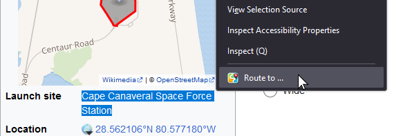

#  Route to ...

A simple Firefox addon (with no required permissions) that adds a context menu entry. This allows you to select any _location text_ on a website and open Google Maps with that location as the destination and your current location as the starting point.

> [!TIP]  
> The _location text_ can be any text that Google Maps can understand, such as an address, a location name, or even a set of coordinates.

> [!TIP]
> Clicking the extension icon in the toolbar will allow you to override the starting point to a fixed location.  
> As before, you can enter any location text that Google Maps can understand.

## Installation

Click on the `.xpi` file in the [latest release](https://github.com/mriot/route-to/releases/latest).

Firefox will ask you to confirm the installation.

> A release on the firefox addon page is planned for the near future.

## Credits

Inspired by various similar extensions, though offering key improvements:
- No permissions required
- Immediately opens the route planner
- Automatically sets your current location as the starting point
- Allows you to override the starting point to a fixed location

## Build and release

[Link to the extension page](https://addons.mozilla.org/en-US/developers/addon/edf88207ee4c466c83b1/versions) (private)

1. `web-ext lint`
2. `web-ext build`
3. [Submit the zip file](https://addons.mozilla.org/en-US/developers/addon/edf88207ee4c466c83b1/versions/submit/)

---

The icon was created with [Image Creator from Microsoft Designer](https://www.bing.com/images/create).
