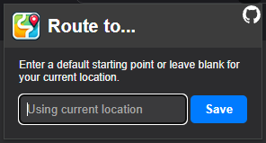

#  Route to ...

A lightweight add-on for Firefox and Chromium-based browsers that requires no permissions. It adds a context menu option, allowing you to highlight any location text on a website and open Google Maps with that location as the destination, using your current location as the starting point.

> [!TIP]  
> The _location text_ can be any text that Google Maps can understand, such as an address, a location name, or even a set of coordinates.

> [!TIP]
> Clicking the extension icon in the toolbar will allow you to override the starting point to a fixed location.  
> As before, you can enter any kind of location that Google Maps can understand.  
> 

## Installation

> [!IMPORTANT]
> This add-on is not yet available on the stores, but you can install it manually.

### Chrome

For now you can just load the extension as an unpacked extension in Chromium-based browsers.

Go to `chrome://extensions/`, enable developer mode, and click on "Load unpacked".

### Firefox

Click on the `.xpi` file in the [latest release](https://github.com/mriot/route-to/releases/latest).

Firefox will ask you to confirm the installation.

## Credits

Inspired by various similar extensions, though offering some improvements:
- No permissions required
- Immediately opens the route planner
- Automatically sets your current location as the starting point
- Allows you to override the starting point to a fixed location

---

The app icon was created using [Image Creator from Microsoft Designer](https://www.bing.com/images/create).
